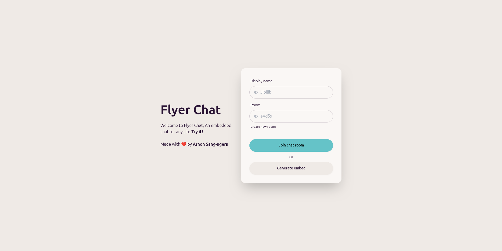

# Flyer Chat - An Embedded Web-Chat

A simple solution for embedding a real-time chat on any website, built with customization and ease of integration in mind.

[Live](https://flyer.iamickdev.com) • [Introduction](#introduction) • [Features](#🌟-features) • [Usage](#🚀-usage) • [License](#license)

## Introduction

Welcome to Flyer Chat! This is a simple solution for embedding a real-time chat on any website. Whether you're running a blog, an e-commerce site, or any other type of web platform, our embedded chat system allows you to provide a seamless and interactive communication experience for your users.

## 🌟 Features

- Real-time chat functionality
- Easy integration with any website
- Customizable appearance to match your site's design with 30+ themes from [daisyUI](https://daisyui.com/)
- Support for multimedia content (images, links, YouTube embeds, etc.)
- Mobile-friendly and responsive design
- URL query configuration

## 🚀 Usage

Once you have integrated the embedded chat into your website, users can easily engage in real-time conversations. Customize the appearance and behavior of the chat to match your site's design and requirements.

## Contributing

Contributions, issues, and feature requests are welcome! Feel free to check [issues page](https://github.com/arnonsang/flyer-chat/issues) or open [pull request](https://github.com/arnonsang/flyer-chat/pulls).

## License

This project is licensed under the MIT License - see the [LICENSE](LICENSE) file for details.

## Author

Made with ❤️ by **[iamickdev](https://www.iamickdev.com)** 
- Website: [www.iamickdev.com](https://www.iamickdev.com)
- Github: [@arnonsang](https://github.com/arnonsang)

---

**From JLR Lab**  
*A Gen Z technology research, consulting and development team based in Thailand.*
